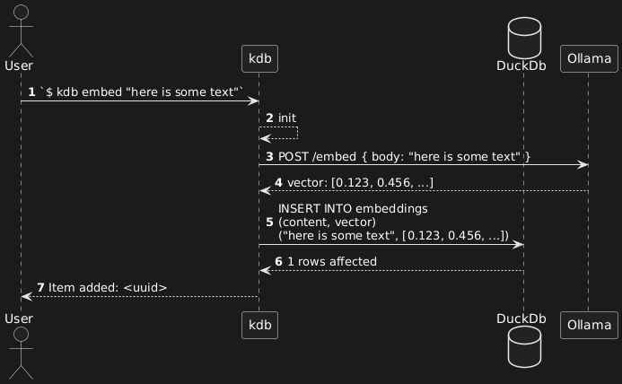
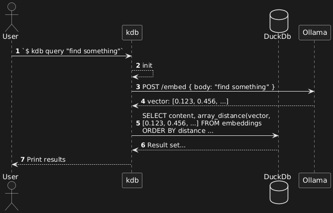

# A knowledge database in your command line
`kdb` is a knowledgebase command line tool that relies on [Ollama](https://github.com/ollama/ollama) for embedding and inference. You can use it as is or integrate it with 3rd party tools to make your own Retrieval Augmented Generation (RAG) system.

## Dependencies
* [Ollama](https://github.com/ollama/ollama)

## Building the project
1. Clone the repository
2. `make build`
3. Your binaries are at `bin/` directory
4. Add them to the `PATH` environment variable.

## Run
Here is the list of available commands
```
kdb --help

Knowledgebase in your command line

Usage:
  kdb [flags]
  kdb [command]

Available Commands:
  list        Lists the embedded entries.
  query       Search in the embedded entries.
  embed       Stores the given text in the vector database.
  delete      Deletes an entry by given id.
  help        Help about any command

Flags:
  -h, --help      help for kdb
  -v, --version   Show version information

Use "kdb [command] --help" for more information about a command.
```

## How embedding works?
```
kdb embed "here is some text"
```


[source](https://www.plantuml.com/plantuml/dumla/RO_BJiCm44Nt_eghY0MLqj3oO16XgekoO4CHBIj0gfEPWjN4hk8n3o7-7LkbFAIiHXgVETTtwaLt4jf6wI3EXhRYJkbQN8S0xP7TUUuojOsGgSrMMy66AaLQTAKzWoeaQXRgpQpwpsNpfj6jpXBWb0eOJj9jYTL1ck2OHSYUkMCO3-zQXl2RP2kLdeTxt5WZkyq4hiJDVB74qUxu0vMZzx9FWa_bVXqld2gLk1yLu-EJ7AFYzEmyHr4KZtjrmgwk5vUtopYMyzttoDWd_s0FQsU5hUJVea5SzMJcVVw1-bjcZCwzUkZrEegOVfg662xSGXCnbRW8mT14JTbIQ9il)

## How data is retrieved?
```
kdb query "find something"
```


[source](https://www.plantuml.com/plantuml/dumla/RO-zJlCm68LtNyLHz0tVa8Ro0qC6L47B10fAou0eedRy0bOJkzYlaIh4lLC7HO1WikJpdCS-ay3IS-nQ8ICx6pj5NiY6dKU43CXk0lbCR7QGQSn6MiPQAw4bIoK3GQkUciPcFLK_kQngMzd9B05EY8ZHQUgMMFrB9ruY-IsoHsCrWkk8durzobOYPQE1DTPmkabbL-AwcY-mHvqYZJSefxVbBmFUXViIl58QK-9kNEmV7EOO5qV79pcAehWVl0cRpovdvmiqpZ9PpY6zbzi7RG9Bsz3_Jqk-j7zeS55NL-Z_f7VlXwMjwkcinjajXdxYnFTPDONOCW9nIeR5SJVG6ylmVHp4XAoENVi1)

The output can be piped to ollama to get the result in a proper format. Take a look at the scripts in the `scripts/` directory.

## ask
You can use your knowledge base by simply running: `ask "some question"`

## learn
A quick way to embed some content for later retrival is using the `learn` script like this: `learn "something"`